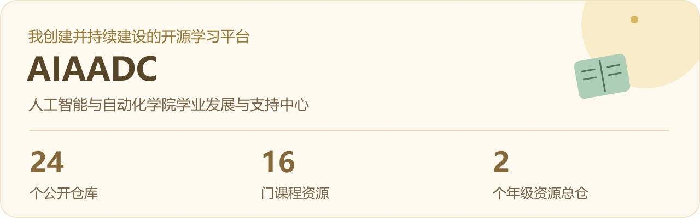
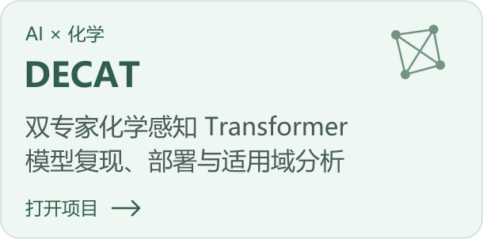
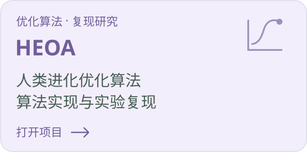
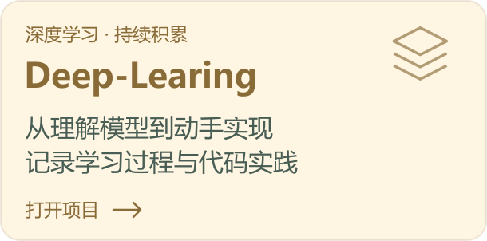
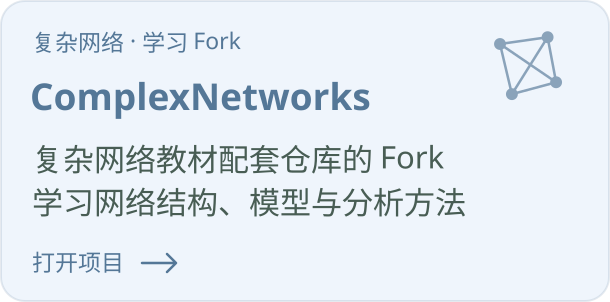

### 让好奇心变成作品，让知识更容易被找到。

华中科技大学在读。探索人工智能与复杂网络，也搭建学习平台、分享课程资料，偶尔创造几只桌面小猫。

[我创建的 AIAADC](#aiaadc) · [研究与学习](#projects) · [我的两只小猫](#cats)

## 🌱 我创建的 AIAADC

我创建并持续建设 **AIAADC 的 GitHub 组织与开源资源体系**，把分散的课程资料、复习经验与同学作品，整理成更容易查找、使用和持续补充的学习平台。

从大一基础课到专业课程，从个人笔记到期中、期末分享会，再到课程资源网站和同学创意项目，希望这里能帮后来者少绕一点路。

| 📚 从课程开始 | 🛠️ 看看平台与共建 |
| :--- | :--- |
| [**大一课程资源总仓**](https://github.com/AIAADC/Resources-for-freshman-in-AIA) | [**课程资源网站 / PWA**](https://github.com/AIAADC/aiaadc-resource-site) |
| [**大二课程资源总仓**](https://github.com/AIAADC/Resources-for-sophomore-in-AIA) | [**同学创意项目**](https://github.com/AIAADC/student-projects) |

<strong>展开完整仓库地图 · 24 个公开仓库</strong>

### 年级导航

- [大一课程资源总仓](https://github.com/AIAADC/Resources-for-freshman-in-AIA)
- [大二课程资源总仓](https://github.com/AIAADC/Resources-for-sophomore-in-AIA)

### 数学与自然科学

- [微积分](https://github.com/AIAADC/wjf)
- [线性代数](https://github.com/AIAADC/linear-algebra)
- [概率论与数理统计](https://github.com/AIAADC/Probability-and-Statistics)
- [大学物理](https://github.com/AIAADC/Physics)
- [离散数学](https://github.com/AIAADC/Discrete-Mathematics)
- [复变函数与积分变换](https://github.com/AIAADC/AIAADC-Complex-Functions-and-Integral-Transforms)
- [数值计算方法](https://github.com/AIAADC/Numerical-Methods)

### 计算机与人工智能

- [C 语言程序设计](https://github.com/AIAADC/C-Programming-Language)
- [数据结构](https://github.com/AIAADC/Data-Structure)
- [数据科学基础](https://github.com/AIAADC/Foundation-of-data-science)
- [人工智能导论](https://github.com/AIAADC/Introduction-to-Artificial-Intelligence)

### 电子、信号与控制

- [电路理论](https://github.com/AIAADC/Circuit-Theory)
- [模拟电子技术](https://github.com/AIAADC/Analog-Electronics-Technology)
- [数字电路](https://github.com/AIAADC/Digital-circuit)
- [自动控制原理](https://github.com/AIAADC/Principles-of-Automatic-Control)
- [信号与系统引论](https://github.com/AIAADC/Introduction-to-Signals-and-Systems)

### 学习分享与同学作品

- [个人笔记分享](https://github.com/AIAADC/Note-Sharing)
- [期中分享会](https://github.com/AIAADC/Midterm-Presentation)
- [期末分享会](https://github.com/AIAADC/Final-Exam-Presentation)
- [同学创意项目](https://github.com/AIAADC/student-projects)

### 平台与组织

- [课程资源网站 / PWA](https://github.com/AIAADC/aiaadc-resource-site)
- [组织主页与说明](https://github.com/AIAADC/.github)

仓库数量为 2026 年 9 月 15 日公开信息快照。

## 🔬 研究、实现与持续学习

我关注 AI 在具体研究问题中的应用，也通过算法复现和课程实践加深理解。

<table>
<tr>
<td width="50%"></td>
<td width="50%"></td>
</tr>
<tr>
<td width="50%"></td>
<td width="50%"></td>
</tr>
</table>

另外还有 [**HRT_ 阶段性任务仓库**](https://github.com/WenNinghan/HRT_-)（目前待补充）。

## 🐾 认真写代码，也认真养电子猫

把一点想象力做成可以陪伴自己的小作品。两只猫都来自我制作的 Codex App 自定义宠物项目。

<table>
<tr>
<td width="50%" align="center">
<h3>月薪喵</h3>

给写代码的日子，加一点陪伴。

<a href="https://github.com/WenNinghan/yuexinmiao-codex-pet">看看月薪喵 →</a>
</td>
<td width="50%" align="center">
<h3>呆猫八条</h3>

一只灰白小猫，也可以有很多表情。

<a href="https://github.com/WenNinghan/daimaobatiao-codex-pet">看看呆猫八条 →</a>
</td>
</tr>
</table>

---

## 保持好奇，慢慢把想法变成真的。

欢迎交流 AI、复杂网络、学习资源，以及有趣的小作品。

[我的全部公开仓库](https://github.com/WenNinghan?tab=repositories) · [AIAADC 开源学习平台](https://github.com/AIAADC)

