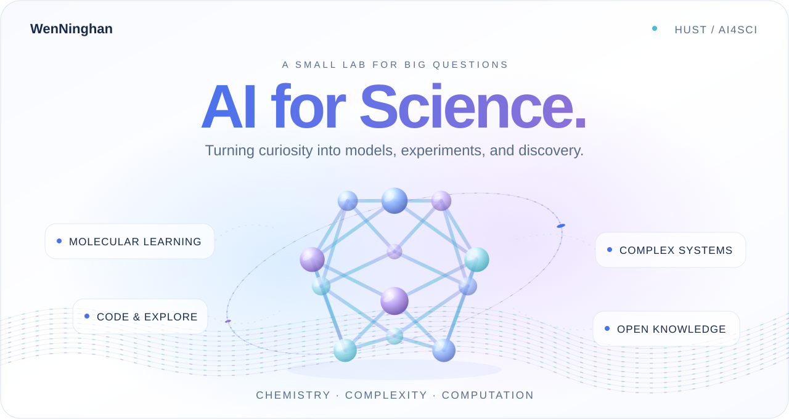
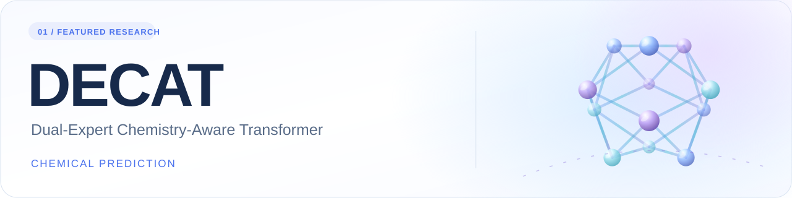
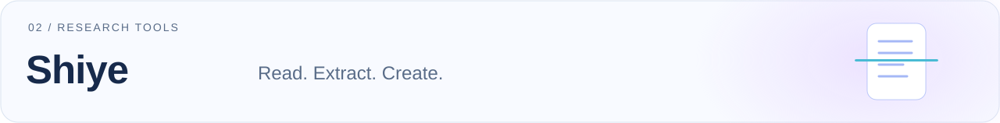
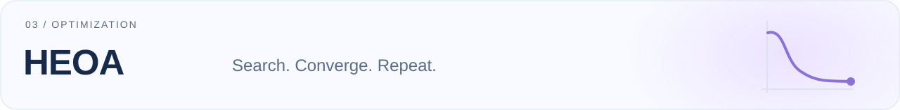

<picture>
  <source media="(prefers-reduced-motion: reduce)" srcset="./assets/lab/hero-still-light.svg">
  <source media="(prefers-color-scheme: dark)" srcset="./assets/lab/hero-dark.svg">
  
</picture>

**华中科技大学 · 人工智能方向学生 · AI4Science**

关注化学预测、复杂系统与科学问题中的优化方法。 把好奇心写进模型，把想法做成可以使用的工具。

[研究与项目](#selected-work) &nbsp; / &nbsp; [开源与共建](#open-learning) &nbsp; / &nbsp; [代码之外](#beyond-research)

### 研究兴趣

**AI for Chemistry** &nbsp; 分子表征、化学预测与模型适用域。 **Complex Systems** &nbsp; 网络结构、系统稳定性与临界转变。 **Scientific Computing** &nbsp; 优化算法、实验复现与科研工具。

## 精选项目 · Selected work

<a href="https://github.com/WenNinghan/DECAT">
<picture>
  <source media="(prefers-reduced-motion: reduce)" srcset="./assets/lab/decat-still-light.svg">
  <source media="(prefers-color-scheme: dark)" srcset="./assets/lab/decat-dark.svg">
  
</picture>
</a>

用**双专家化学感知 Transformer** 预测臭氧反应速率常数（logk），提供模型复现、交互推理与适用域分析。

`Python` &nbsp; `Transformer` &nbsp; `AI for Chemistry`

[**探索 DECAT →**](https://github.com/WenNinghan/DECAT)

 

<a href="https://github.com/WenNinghan/shiye">
<picture>
  <source media="(prefers-reduced-motion: reduce)" srcset="./assets/lab/shiye-still-light.svg">
  <source media="(prefers-color-scheme: dark)" srcset="./assets/lab/shiye-dark.svg">
  
</picture>
</a>

**[识页 Shiye](https://github.com/WenNinghan/shiye)** · 本地 OCR、公式校对与 Word / Markdown / PDF 导出，把论文、讲义和截图变成可编辑文档。

`Research tools` &nbsp; `OCR` &nbsp; [查看识页 →](https://github.com/WenNinghan/shiye)

 

<a href="https://github.com/WenNinghan/HEOA">
<picture>
  <source media="(prefers-reduced-motion: reduce)" srcset="./assets/lab/heoa-still-light.svg">
  <source media="(prefers-color-scheme: dark)" srcset="./assets/lab/heoa-dark.svg">
  
</picture>
</a>

**[HEOA](https://github.com/WenNinghan/HEOA)** · 人类进化优化算法的实现与复现：三杆桁架约束优化、收敛分析与可行性检验。

`Optimization` &nbsp; `Python` &nbsp; [查看算法实践 →](https://github.com/WenNinghan/HEOA)

**持续学习** &nbsp; [Deep-Learing](https://github.com/WenNinghan/Deep-Learing) · 基于教材的深度学习实践 &nbsp; / &nbsp; [ComplexNetworks](https://github.com/WenNinghan/ComplexNetworks) · 复杂网络学习资源（Fork）

## 开源与共建 · Open learning

<a href="https://github.com/AIAADC">
<picture>
  <source media="(prefers-reduced-motion: reduce)" srcset="./assets/lab/aiaadc-still-light.svg">
  <source media="(prefers-color-scheme: dark)" srcset="./assets/lab/aiaadc-dark.svg">
  
</picture>
</a>

**让知识更容易被找到。**

我创建并持续建设 AIAADC 的开源学习资源体系，把课程资料、学习笔记、复习经验与同学作品连接起来。希望自己走过的路，也能成为后来者的起点。

[**组织主页 ↗**](https://github.com/AIAADC) &nbsp; · &nbsp; [课程资源平台](https://github.com/AIAADC/aiaadc-resource-site)

[大一资源](https://github.com/AIAADC/Resources-for-freshman-in-AIA) &nbsp; · &nbsp; [大二资源](https://github.com/AIAADC/Resources-for-sophomore-in-AIA) &nbsp; · &nbsp; [同学作品](https://github.com/AIAADC/student-projects)

展开课程与资源导航

**数学与自然科学**

[微积分](https://github.com/AIAADC/wjf) · [线性代数](https://github.com/AIAADC/linear-algebra) · [概率论与数理统计](https://github.com/AIAADC/Probability-and-Statistics) · [大学物理](https://github.com/AIAADC/Physics) · [离散数学](https://github.com/AIAADC/Discrete-Mathematics) · [复变函数与积分变换](https://github.com/AIAADC/AIAADC-Complex-Functions-and-Integral-Transforms) · [数值计算方法](https://github.com/AIAADC/Numerical-Methods)

**计算机与人工智能**

[C 语言程序设计](https://github.com/AIAADC/C-Programming-Language) · [数据结构](https://github.com/AIAADC/Data-Structure) · [数据科学基础](https://github.com/AIAADC/Foundation-of-data-science) · [人工智能导论](https://github.com/AIAADC/Introduction-to-Artificial-Intelligence)

**电子、信号与控制**

[电路理论](https://github.com/AIAADC/Circuit-Theory) · [模拟电子技术](https://github.com/AIAADC/Analog-Electronics-Technology) · [数字电路](https://github.com/AIAADC/Digital-circuit) · [自动控制原理](https://github.com/AIAADC/Principles-of-Automatic-Control) · [信号与系统引论](https://github.com/AIAADC/Introduction-to-Signals-and-Systems)

**分享与共建**

[个人笔记](https://github.com/AIAADC/Note-Sharing) · [期中分享会](https://github.com/AIAADC/Midterm-Presentation) · [期末分享会](https://github.com/AIAADC/Final-Exam-Presentation) · [组织说明](https://github.com/AIAADC/.github)

## 代码之外 · A little joy

认真探索，也给想象力留一点位置。两只我制作的桌面小猫，陪伴写代码的日常。

&nbsp; &nbsp; &nbsp; &nbsp;

[月薪喵](https://github.com/WenNinghan/yuexinmiao-codex-pet) &nbsp; &nbsp; · &nbsp; &nbsp; [呆猫八条](https://github.com/WenNinghan/daimaobatiao-codex-pet)

---

**以好奇为起点，以可复现为习惯。**

欢迎交流 AI4Science、复杂系统、科研工具与开源学习。

[浏览全部项目 ↗](https://github.com/WenNinghan?tab=repositories) &nbsp; · &nbsp; [一起建设 AIAADC ↗](https://github.com/AIAADC)

